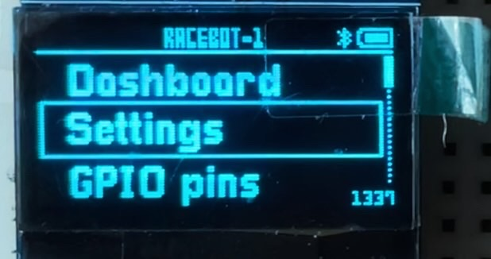
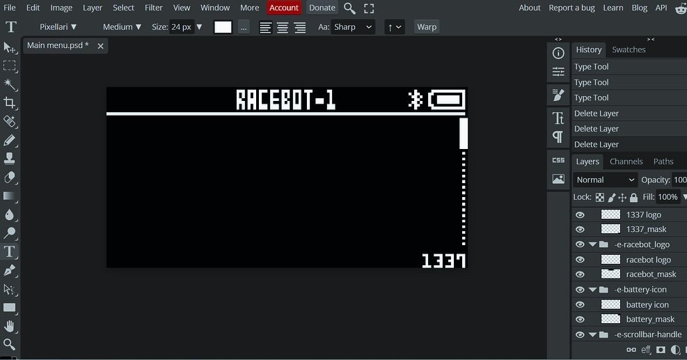

# Project Assets Preview

This README displays all UI and asset images used in the project.

---

## Logos

### 1337 Logo

### Racebot Logo

---

## Navigation & Dashboard

### Dashboard Icon

### Settings Icon

### About Icon

---

## Battery & Connectivity

### Battery Icon (Variant 1)

### Battery Icon (Variant 2)

### Bluetooth Icon

---

## Layout & Structure

### Page Structure

---

## Scrollbar UI

### Scrollbar

### Scrollbar Handle

---

## Notes

- All images are stored inside the `assets/` directory.
- Ensure filenames match exactly (case-sensitive on Linux/macOS).

---

## Hardware & Design

### Menu on OLED Display

### MCU Setup

### Photopea Design File

